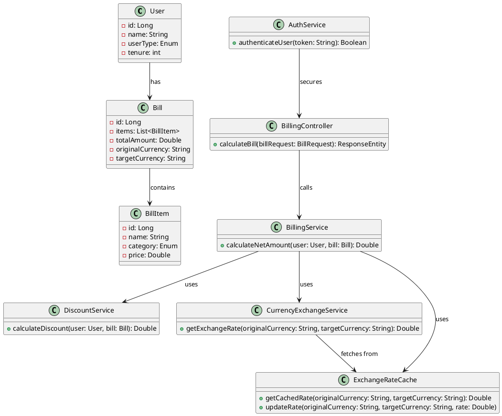

# BE Assessment
## Retail Billing System

## Overview

The Retail Billing System is a Spring Boot-based application that provides authentication, billing, and currency
exchange services. It integrates with a third-party currency exchange API to calculate the total payable amount after
applying discounts and currency conversion.

## Features

- **User Authentication**: JWT-based authentication.
- **Discount Calculation**: Applies various discounts based on user type and purchase.
- **Currency Conversion**: Converts the total payable amount to the target currency.
- **Caching**: Uses Caffeine and Redis for caching exchange rates.
- **API Endpoints**:
    - `/api/auth/login` - Authenticate users and return JWT token.
    - `/api/auth/convert` - Convert currency between different denominations.
    - `/api/billing/calculate` - Calculate the final bill after applying discounts and currency conversion.

## UML Class Diagram




### User Table (`users`)

| Column Name | Type    | Description                       |
|-------------|---------|-----------------------------------|
| id          | BIGINT  | Primary Key                       |
| username    | VARCHAR | Unique username                   |
| password    | VARCHAR | Encrypted password                |
| role        | VARCHAR | User role (ROLE_USER, ROLE_ADMIN) |

### Billing Table (`billing`)

| Column Name  | Type    | Description                |
|--------------|---------|----------------------------|
| id           | BIGINT  | Primary Key                |
| user_id      | BIGINT  | Foreign Key to users table |
| total_amount | DECIMAL | Total bill amount          |
| currency     | VARCHAR | Original currency          |

## Postman Collection Setup

1. Open Postman.
2. Click `Import`.
3. Select `Raw Text` and paste the following JSON:

```json
{
  "info": {
    "_postman_id": "your-unique-id",
    "name": "Assessment Task API",
    "schema": "https://schema.getpostman.com/json/collection/v2.1.0/collection.json"
  },
  "item": [
    {
      "name": "Auth APIs",
      "item": [
        {
          "name": "Login",
          "request": {
            "method": "POST",
            "header": [
              {
                "key": "Content-Type",
                "value": "application/json"
              }
            ],
            "body": {
              "mode": "raw",
              "raw": "{\"username\": \"testuser\", \"password\": \"password123\"}"
            },
            "url": {
              "raw": "{{base_url}}/api/auth/login",
              "host": ["{{base_url}}"],
              "path": ["api", "auth", "login"]
            }
          }
        },
        {
          "name": "Welcome",
          "request": {
            "method": "GET",
            "url": {
              "raw": "{{base_url}}/api/auth/welcome",
              "host": ["{{base_url}}"],
              "path": ["api", "auth", "welcome"]
            }
          }
        }
      ]
    },
    {
      "name": "Currency Exchange APIs",
      "item": [
        {
          "name": "Convert Currency",
          "request": {
            "method": "GET",
            "url": {
              "raw": "{{base_url}}/api/auth/convert?baseCurrency=USD&targetCurrency=EUR",
              "host": ["{{base_url}}"],
              "path": ["api", "auth", "convert"],
              "query": [
                {"key": "baseCurrency", "value": "USD"},
                {"key": "targetCurrency", "value": "EUR"}
              ]
            }
          }
        }
      ]
    },
    {
      "name": "Billing APIs",
      "item": [
        {
          "name": "Calculate Bill",
          "request": {
            "method": "POST",
            "header": [
              {
                "key": "Content-Type",
                "value": "application/json"
              }
            ],
            "body": {
              "mode": "raw",
              "raw": "{\"userType\": \"EMPLOYEE\", \"registrationDate\": \"2020-01-01\", \"items\": [{\"item\": \"Laptop\", \"price\": 1200}], \"originalCurrency\": \"USD\", \"targetCurrency\": \"EUR\"}"
            },
            "url": {
              "raw": "{{base_url}}/api/billing/calculate",
              "host": ["{{base_url}}"],
              "path": ["api", "billing", "calculate"]
            }
          }
        }
      ]
    }
  ],
  "variable": [
    {
      "key": "base_url",
      "value": "http://localhost:8080",
      "type": "string"
    }
  ]
}
```

4. Click `Import`.
5. Run the API requests with the appropriate headers and body.

## How to Run

1. Clone the repository.
2. Navigate to the project directory.
3. Run `mvn clean install` to build the project.
4. Start the application using `mvn spring-boot:run`.
5. Use Postman to test the API endpoints.

## Technologies Used

- **Spring Boot** (Web, Security, Data JPA, Cache, Validation)
- **JWT Authentication**
- **Caffeine & Redis Caching**
- **H2/MySQL Database**
- **Lombok, Logback, Postman**
- **JUnit, Mockito for Testing**

## License

This project is licensed under the MIT License - see the [LICENSE](LICENSE) file for details.

